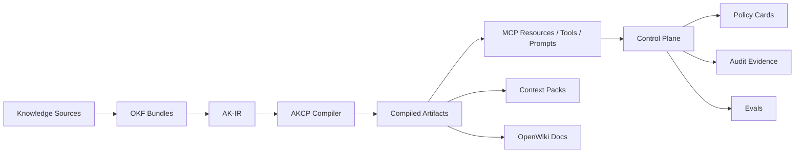

# Agent Knowledge Compiler and Control Plane (AKCP)

Agent Knowledge Compiler and Control Plane (AKCP) is an open-source system for compiling organizational knowledge into governed, versioned, testable, cost-aware, agent-consumable artifacts, and for controlling how agents discover, retrieve, use, and act on that knowledge through MCP-compatible capabilities.

## What AKCP is

AKCP explicitly separates the lifecycle of agent knowledge into two operational planes:

1. **Compiler Pipeline**: Ingests raw organizational knowledge (docs, wikis, runbooks), normalizes it into OKF and AK-IR formats, and compiles it into semantically dense, strictly-typed artifacts (Context Packs, MCP Resources, OpenWiki Docs, Eval datasets).
2. **Control Plane**: Governs how autonomous agents interact with these artifacts at runtime. It features a capability registry, machine-readable policy cards, strict Human-In-The-Loop (HITL) approvals, and full audit telemetry.

## What AKCP is not

- **Not just a vector database or probabilistic RAG pipeline**: AKCP focuses on determinism, governance, and static context compilation.
- **Not a generic framework for building AI agents**: AKCP does not orchestrate agents (like LangGraph or AutoGen). Instead, it provides the deterministic _context_ and _capabilities_ those agents consume.
- **Not OpenWiki**: OpenWiki _authors_ and maintains codebase documentation. AKCP _compiles and governs_ knowledge across formats.
- **Not OKF**: OKF provides a minimal portable knowledge format. AKCP implements the runtime orchestrator around it.
- **Not MCP**: MCP provides a protocol for tools and resources. AKCP wraps MCP with budgetary controls and governance.

## Why this matters

AI agents today suffer from structural hallucination: they lack deterministic grounding. Enterprises cannot afford unpredictable agentic behavior, especially when agents have side-effect capabilities (e.g., executing scripts, deploying infrastructure). Standard tools solve parts of the problem, but fail to provide a cohesive supply chain from raw documentation to controlled agent side-effects. AKCP solves this by treating knowledge and tools as governed, versioned artifacts.

## Architecture at a glance



## Compiler Pipeline

The AKCP compiler treats organizational knowledge like source code:
1. **Source**: Knowledge is structured using [OKF (Open Knowledge Format)](docs/integrations/okf.md).
2. **IR**: It parses into the [Agent Knowledge IR (AK-IR)](docs/reference/agent-knowledge-ir.md) for AST-level validation and linkage.
3. **Target**: It generates optimized outputs via [Compile Targets](docs/reference/compile-targets.md) tailored for different agents and systems.

## Control Plane Model

At runtime, the Control Plane ensures safe agent execution:
1. **Capability Registry**: Maps tools and resources.
2. **Policy Cards**: Define strict constraints (e.g., [Policy Cards Spec](docs/reference/policy-cards.md)).
3. **Approvals**: Pauses execution for Human-In-The-Loop confirmation.
4. **Telemetry & Audit**: Logs every token and action for [Audit Evidence](docs/observability/telemetry.md).

## Flagship Domains

To prove its domain-agnostic architecture, AKCP implements distinct flagship scenarios:

| Domain | Why it exists | What it demonstrates |
|---|---|---|
| Career | low-friction starter domain | personal knowledge compilation |
| IT Operations | enterprise flagship | runbooks, incidents, approvals, audit |
| Customer Support | future enterprise flagship | PII, policies, macros, escalation, history |

## Current Maturity Status

| Area | Status | Evidence | Limitation | Next milestone |
|---|---|---|---|---|
| Compiler CLI | Beta | tests + examples | no npm release yet | global CLI distribution |
| AK-IR | Beta | spec + fixtures | requires manual tuning | automatic normalization |
| MCP servers | Beta | contract tests | local-only | secure remote hosting |
| Control Plane | Alpha/Beta | policy cards + audit | dashboard is a stub | comprehensive dashboard |
| Career flagship | Stable demo | walkthrough | limited tool scope | expansion |
| IT Ops flagship | Beta enterprise demo | walkthrough | mocked infrastructure | real cloud integrations |
| Customer Support | Planned | design prompt | not implemented | future flagship |

## Quickstart

### Local workspace flow (Recommended)

As AKCP is not yet published to npm, you must run it directly from source.

```bash
# 1. Clone the repository
git clone https://github.com/vfcarida/Agent-Knowledge-Compiler-and-Control-Plane.git akcp
cd akcp

# 2. Setup the environment
corepack enable
pnpm install --frozen-lockfile
pnpm build

# 3. Validate your environment
pnpm akcp --help
pnpm akcp validate --bundle examples/career
pnpm akcp compile --config examples/career/akcp.yaml
```

## CLI Examples

The `akcp` CLI manages your knowledge bundles:

| Command          | Purpose                                | Example                                             |
| ---------------- | -------------------------------------- | --------------------------------------------------- |
| `akcp doctor`    | Validate local environment             | `akcp doctor`                                       |
| `akcp compile`   | Compile knowledge into AK-IR/artifacts | `akcp compile --config examples/career/akcp.yaml`   |
| `akcp validate`  | Validate bundle/spec/config            | `akcp validate --bundle examples/career`            |
| `akcp serve mcp` | Serve compiled artifacts through MCP   | `akcp serve mcp --profile career`                   |

For full details, see [CLI Usage](docs/cli/usage.md).

## Repository Structure

- `packages/core/`: The OKF parser, compiler, and AK-IR normalization engine.
- `packages/cli/`: The `akcp` command-line interface.
- `packages/mcp-profile-server/`: Exposes context via MCP.
- `packages/mcp-automation-server/`: Controls agentic side-effects via Playwright/HITL.
- `packages/conformance/`: Test suite for OKF and AKCP compatibility.
- `examples/domains/`: Working demo architectures for the flagship domains.

## Specs and Standards

AKCP relies on Spec-Driven Development:
- [Agent Knowledge IR (AK-IR)](docs/reference/agent-knowledge-ir.md)
- [AKCP Configuration (`akcp.yaml`)](docs/reference/akcp-yaml.md)
- [Compile Targets & Manifests](docs/reference/compile-targets.md)
- [Policy Cards](docs/reference/policy-cards.md)
- [Conformance Specification](docs/reference/conformance.md)

## MCP and OKF Compatibility

- AKCP natively supports the Model Context Protocol. See [MCP Security](docs/security/mcp-security.md) and [Tool Contracts](docs/reference/mcp-tool-contracts.md).
- AKCP acts as the orchestrator for [Open Knowledge Format (OKF)](docs/integrations/okf.md).

## Security and Governance

Security is embedded at the architectural level:
- [Threat Model](docs/security/threat-model.md)
- [Automation Safety](docs/security/automation-safety.md)
- [NIST AI RMF Mapping](docs/governance/nist-ai-rmf-mapping.md)
- [OWASP LLM Controls](docs/governance/owasp-llm-controls.md)

## Testing and Conformance

Ensure quality by running the comprehensive test suite:
```bash
pnpm test -- --run
pnpm check:docs
pnpm check:links
```
For evaluation frameworks, see the [Evals Documentation](docs/testing/evals.md).

## Roadmap

See the [Community Roadmap](docs/community/roadmap.md).

## Contributing

See [CONTRIBUTING.md](CONTRIBUTING.md) for code-level guidelines.

## Backwards Compatibility & Migration

The repository was previously known as Open Career Format (OCF), ContextOps, and Agent-ready Knowledge Reference Architecture. Legacy CLI commands (`ocf`, `agent-ready`) continue to route to the main `akcp` binary while emitting a deprecation warning.

| Legacy Concept | Canonical AKCP Concept | Migration Status |
| --- | --- | --- |
| `Open Career Format (OCF)` | Agent Knowledge Compiler and Control Plane (AKCP) | Identity updated. Internal references are deprecated. |
| `ContextOps` | AKCP Control Plane | Identity updated. |
| `ocf` CLI command | `akcp` | Supported with deprecation warning. |
| `agent-ready` CLI command | `akcp` | Supported with deprecation warning. |

---

_Licensed under MIT._
