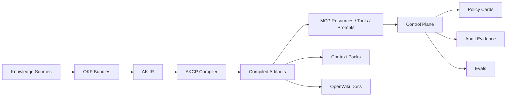

# Agent Knowledge Compiler and Control Plane (AKCP)

[](https://github.com/vfcarida/Agent-Knowledge-Compiler-and-Control-Plane/actions/workflows/ci.yml) [](https://github.com/vfcarida/Agent-Knowledge-Compiler-and-Control-Plane/actions/workflows/codeql.yml) [](https://opensource.org/licenses/MIT) [](https://nodejs.org) [](https://www.typescriptlang.org/)

Agent Knowledge Compiler and Control Plane (AKCP) is an open-source system for compiling organizational knowledge into governed, versioned, testable, cost-aware, agent-consumable artifacts, and controlling how agents discover, retrieve, and act on that knowledge through MCP-compatible capabilities.

## Why AKCP

AI agents today suffer from structural hallucination: they lack deterministic grounding.

- **Supply Chain Trust**: Provides a cohesive pipeline from raw documentation to controlled agent side-effects.
- **Deterministic Grounding**: Stops unpredictable behavior by compiling knowledge into strictly-typed artifacts.
- **Enterprise Safety**: Adds Human-In-The-Loop approvals, policy constraints, and audit telemetry to agent actions.

## What it does

```bash
# Input: organizational runbooks, incident procedures, SLOs
examples/domains/it-operations/runbooks/high-cpu.md
examples/domains/it-operations/policies/execute_remediation.policy.yaml

# Compile into governed, agent-consumable artifacts
pnpm akcp compile --config examples/domains/it-operations/akcp.yaml

# Output:
# → dist/agent-knowledge-ir.json        (normalized runbook IR)
# → dist/mcp-resources.json       (MCP tools: diagnose, remediate, escalate)
# → dist/policy-bundle.json       (HITL requirements, side-effect rules)
# → dist/eval-dataset.json        (incident response scenarios)
```

## Architecture at a glance



## Key Features

- **Compiler Pipeline**: Ingests raw organizational knowledge (OKF, wikis) and normalizes it into AST-level Agent Knowledge IR (AK-IR).
- **Compile Targets**: Generates optimized outputs like Context Packs, MCP Resources, OpenWiki Docs, and Eval datasets.
- **Control Plane**: Governs agent interactions at runtime with strict capability mapping and audit telemetry.
- **Policy Cards**: Define strict constraints on autonomy, tools, and side-effects.
- **Human-In-The-Loop**: Two-phase commits to pause agent execution for critical real-world side-effects.
- **MCP Compatibility**: Natively supports the Model Context Protocol for tools, resources, and prompts.

## Quickstart

```bash
# 1. Clone the repository
git clone https://github.com/vfcarida/Agent-Knowledge-Compiler-and-Control-Plane.git akcp
cd akcp

# 2. Setup the environment
corepack enable
pnpm install --frozen-lockfile

# 3. Validate and compile an IT-Ops example bundle
pnpm akcp validate --bundle examples/domains/it-operations --profile it-operations
pnpm akcp compile --config examples/domains/it-operations/akcp.yaml
```

## Documentation

| Topic                     | Links                                                                                                                                                                                           |
| ------------------------- | ----------------------------------------------------------------------------------------------------------------------------------------------------------------------------------------------- |
| **Getting Started**       | [Quickstart](docs/getting-started/quickstart.md) • [Flagship Examples](docs/getting-started/examples.md) • [Migration](docs/getting-started/migration.md)                                       |
| **Concepts**              | [Overview](docs/concepts/overview.md) • [OKF](docs/concepts/okf.md) • [AK-IR](docs/concepts/ak-ir.md) • [Compiler](docs/concepts/compiler.md) • [Control Plane](docs/concepts/control-plane.md) |
| **Specs & Standards**     | [AKCP Config](docs/specs/akcp-yaml.md) • [Policy Cards](docs/specs/policy-cards.md) • [MCP Tools](docs/specs/mcp-tool-contracts.md) • [Conformance](docs/specs/conformance.md)                  |
| **Security & Governance** | [Threat Model](docs/security/threat-model.md) • [Automation Safety](docs/security/automation-safety.md) • [MCP Hardening](docs/security/mcp-hardening.md)                                       |
| **Reference**             | [CLI Usage](docs/reference/cli.md) • [Compile Targets](docs/reference/compile-targets.md) • [Glossary](docs/glossary.md) • [Architecture](docs/architecture/README.md)                          |

- [How AKCP Compares](docs/concepts/comparison.md) — Positioning vs RAG, LangGraph, MCP

## Current Maturity Status

| Area | Status | Evidence | Next milestone |
|------|--------|----------|----------------|
| AKCP CLI | Beta | tests, examples, init command | npm publish |
| AK-IR Compiler | Beta | spec, fixtures, pipeline stages | auto-normalization |
| MCP Profile Server | Beta | contract tests, SSE transport | remote hosting |
| MCP Automation Server | Alpha | safety tests, browser automation | real cloud integrations |
| Control Plane (Gateway) | Beta | auth, rate limit, HITL, PII, WAF | distributed deployment |
| Dashboard UI | Alpha | React app, e2e tests, Express server | feature completion |
| IT Operations (flagship) | Beta | policies, evals, expected-output | real infrastructure |
| Career (starter) | Stable | full walkthrough, golden outputs | |
| Customer Support | Alpha | sources, 8 policies, capabilities, evals | full implementation |
| VSCode Extension | Experimental | syntax highlighting | validation, autocomplete |
| Legacy CLI | Deprecated | deprecation warnings | removal in v1.0 |

For formal definitions, see the [Maturity and Status Guide](docs/status.md).

## Contributing & Community

We actively welcome community contributions. To get started, read [CONTRIBUTING.md](CONTRIBUTING.md) and review our [Governance Process](docs/governance/spec-governance.md).

- [GitHub Discussions](https://github.com/vfcarida/Agent-Knowledge-Compiler-and-Control-Plane/discussions) — Questions, ideas, and community conversations

---

_Licensed under MIT._
