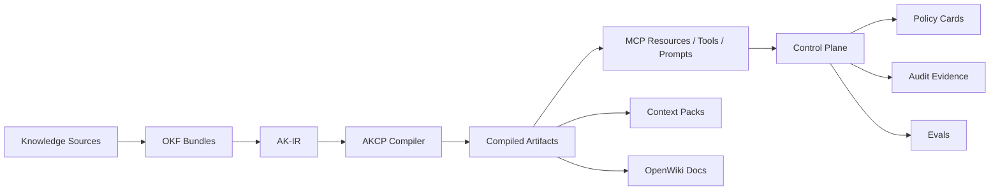

# Agent Knowledge Compiler and Control Plane (AKCP)

[](https://github.com/vfcarida/Agent-Knowledge-Compiler-and-Control-Plane/actions/workflows/ci.yml) [](https://github.com/vfcarida/Agent-Knowledge-Compiler-and-Control-Plane/actions/workflows/codeql.yml) [](https://opensource.org/licenses/MIT) [](https://nodejs.org) [](https://www.typescriptlang.org/)

Agent Knowledge Compiler and Control Plane (AKCP) is an open-source system for compiling organizational knowledge into governed, versioned, testable, cost-aware, agent-consumable artifacts, and controlling how agents discover, retrieve, and act on that knowledge through MCP-compatible capabilities.

## Why AKCP

AI agents today suffer from structural hallucination: they lack deterministic grounding.
- **Supply Chain Trust**: Provides a cohesive pipeline from raw documentation to controlled agent side-effects.
- **Deterministic Grounding**: Stops unpredictable behavior by compiling knowledge into strictly-typed artifacts.
- **Enterprise Safety**: Adds Human-In-The-Loop approvals, policy constraints, and audit telemetry to agent actions.

## What it does

```bash
# Input: raw organizational knowledge (markdown, wikis, runbooks)
examples/domains/it-operations/runbooks/high-cpu.md

# Output: governed, versioned, agent-consumable artifacts
pnpm akcp compile --config examples/domains/it-operations/akcp.yaml
# → dist/knowledge-ir.json      (normalized intermediate representation)
# → dist/mcp-resources.json     (MCP-compatible resource manifest)
# → dist/policy-bundle.json     (governance constraints)
# → dist/eval-dataset.json      (test scenarios)
```

## Architecture at a glance



## Key Features

- **Compiler Pipeline**: Ingests raw organizational knowledge (OKF, wikis) and normalizes it into AST-level Agent Knowledge IR (AK-IR).
- **Compile Targets**: Generates optimized outputs like Context Packs, MCP Resources, OpenWiki Docs, and Eval datasets.
- **Control Plane**: Governs agent interactions at runtime with strict capability mapping and audit telemetry.
- **Policy Cards**: Define strict constraints on autonomy, tools, and side-effects.
- **Human-In-The-Loop**: Two-phase commits to pause agent execution for critical real-world side-effects.
- **MCP Compatibility**: Natively supports the Model Context Protocol for tools, resources, and prompts.

## Quickstart

```bash
# 1. Clone the repository
git clone https://github.com/vfcarida/Agent-Knowledge-Compiler-and-Control-Plane.git akcp
cd akcp

# 2. Setup the environment
corepack enable
pnpm install --frozen-lockfile

# 3. Validate an example bundle
pnpm akcp validate --bundle examples/domains/career --profile career
```

## Documentation

| Topic | Links |
|---|---|
| **Getting Started** | [Quickstart](docs/getting-started/quickstart.md) • [Flagship Examples](docs/getting-started/examples.md) • [Migration](docs/getting-started/migration.md) |
| **Concepts** | [Overview](docs/concepts/overview.md) • [OKF](docs/concepts/okf.md) • [AK-IR](docs/concepts/ak-ir.md) • [Compiler](docs/concepts/compiler.md) • [Control Plane](docs/concepts/control-plane.md) |
| **Specs & Standards** | [AKCP Config](docs/specs/akcp-yaml.md) • [Policy Cards](docs/specs/policy-cards.md) • [MCP Tools](docs/specs/mcp-tool-contracts.md) • [Conformance](docs/specs/conformance.md) |
| **Security & Governance** | [Threat Model](docs/security/threat-model.md) • [Automation Safety](docs/security/automation-safety.md) • [MCP Hardening](docs/security/mcp-hardening.md) |
| **Reference** | [CLI Usage](docs/reference/cli.md) • [Compile Targets](docs/reference/compile-targets.md) • [Glossary](docs/glossary.md) • [Architecture](docs/architecture/README.md) |

## Current Maturity Status

| Area | Status | Evidence | Limitation | Next milestone |
|---|---|---|---|---|
| AKCP CLI compile | Beta | tests + examples | no npm release yet | global CLI distribution |
| AK-IR | Beta | spec + fixtures | requires manual tuning | automatic normalization |
| MCP servers | Beta | contract tests | local-only | secure remote hosting |
| Control Plane (Automation) | Experimental | safety tests | missing dashboard | real e2e integrations |
| Dashboard UI | Experimental | package stubbed | no react UI | build MVP |
| Career flagship | Stable | walkthrough | limited tool scope | expansion |
| IT Ops flagship | Beta | architecture | mocked infrastructure | real cloud integrations |
| Customer Support | Experimental | design doc | experimental | integration |
| Legacy CLI (`ocf` / `agent-ready`) | Deprecated | CI check logic | legacy usage | removal in v1.0 |

For formal definitions, see the [Maturity and Status Guide](docs/status.md).

## Contributing & Community

We actively welcome community contributions. To get started, read [CONTRIBUTING.md](CONTRIBUTING.md) and review our [Governance Process](docs/governance/spec-governance.md).

---

_Licensed under MIT._
