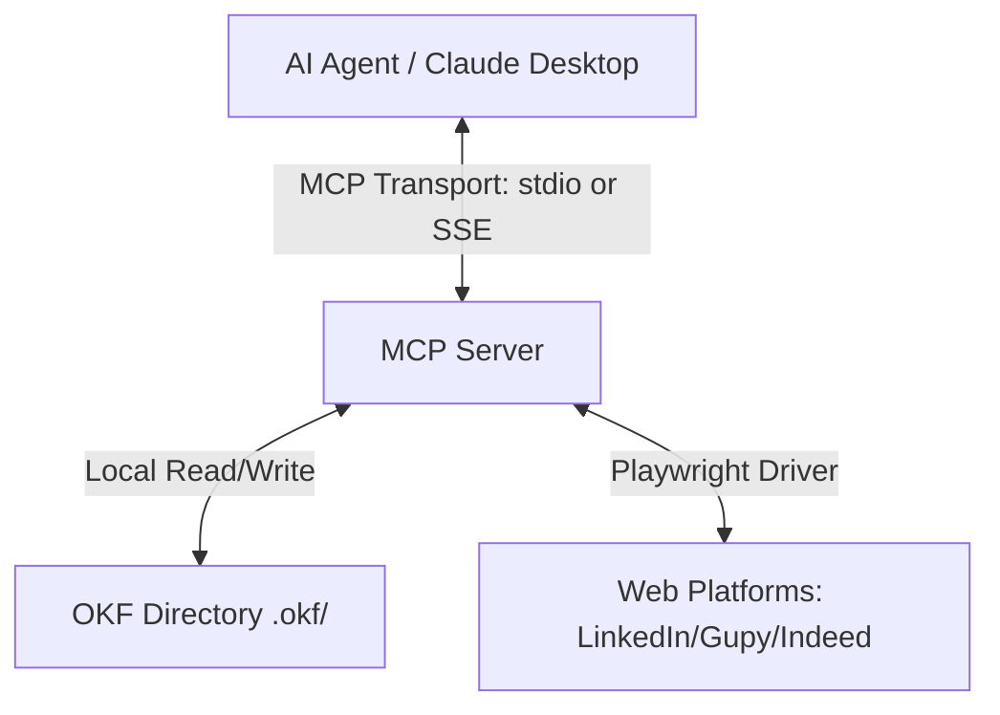

# Agent-Oriented Architecture: Unifying Knowledge and Execution via OKF & MCP

This document establishes the official architectural specification and engineering guidelines for the **Agent Knowledge Compiler and Control Plane (AKCP)**. It describes the integration of Google Cloud's **Open Knowledge Format (OKF)** for structured career memory and Anthropic's **Model Context Protocol (MCP)** for secure, automated execution.

---

## 💡 1. Executive Vision: Organizing Knowledge for AI Agents

Maximizing the ROI of Artificial Intelligence within enterprise software and personal agents depends on how knowledge is structured. Historically, corporate and personal data resides in fragmented silos: department wikis, legacy databases, untracked logs, and loose comments. Unstructured data forces developers to write complex, ad-hoc integrations for every new LLM or tool.

To bypass this integration debt, AKCP integrates two core industry standards:

1.  **Open Knowledge Format (OKF)**: A vendor-neutral standard initiated by Google Cloud. It structures knowledge concepts inside standard directories using Markdown files and structured YAML frontmatter, making data readable by both humans and LLMs without heavy SDK dependencies.
2.  **Model Context Protocol (MCP)**: An open standard created by Anthropic that defines how AI clients securely connect to local or remote data sources, filesystem contexts, and external automation tools using a unified client-server interface.

### 1.1 The Practical Materialization: Agent Knowledge Compiler and Control Plane (AKCP)

While the combined pattern of OKF and MCP is vertical-agnostic (applicable to finance, medical records, or IT operations), the **Agent Knowledge Compiler and Control Plane (AKCP)** serves as the reference implementation. AKCP maps a candidate's complete professional journey, including skills, experiences, target job preferences, and application funnels, allowing autonomous agents to evaluate vacancies, tailor resumes, and execute browser automation securely.

---

## 🔌 2. Technical Deep Dive: Model Context Protocol (MCP)

MCP shifts integration responsibilities away from the core orchestrator application into modular, independent server instances.



### 2.1 Transport Topologies

1.  **Local Transport (stdio)**: The MCP server is spawned as a child process of the client IDE or host desktop, communicating via standard input/output streams. This is the recommended practice for local workflows requiring low latency and high security (e.g., local filesytem parsing and browser driver automation).
2.  **Remote Transport (HTTP with SSE)**: The server operates as an external network endpoint. Calls are sent via standard HTTP POST requests, and server updates are streamed back using Server-Sent Events (SSE). This is ideal for cloud database connectors, shared RAG indexes, and third-party APIs.

### 2.2 Core Architectural Primitives

A compliant MCP server segregates capabilities into three primary abstractions:

- **Resources**: Static, read-only data nodes exposed to the LLM (e.g., the raw contents of the candidate's `.md` profile files).
- **Prompts**: Standardized, optimized instructions or system-level templates to guide LLMs through structured actions.
- **Tools**: Executable functions that perform side-effects on the external environment (e.g., triggering a Playwright workflow to apply for a job). Tools must validate inputs against rigid JSON schemas (Zod).

### 2.3 Integration Best Practices

- **Domain Decoupling**: Avoid monolithic MCP servers. Segregate responsibilities (e.g., run a dedicated `okf-file-mcp` for filesystem operations, and a separate `browser-automation-mcp` for Playwright tasks).
- **Human-in-the-Loop (HITL)**: Any executable tool modifying state or making external commitments (e.g., submitting a job application form) must be intercepted, requiring manual approval before sending the final network payload.
- **Semantic Error Propagation**: Servers must handle exceptions internally. Crashes are prohibited. Instead, the server must format errors cleanly and pass descriptions back to the LLM, enabling autonomous self-correction cycles.

---

## 📝 3. Technical Deep Dive: Open Knowledge Format (OKF)

OKF avoids vendor lock-in by relying on simple filesystems. A career bundle contains directories of Markdown concepts with strict YAML headers.

```
.okf/
├── skills/
│   ├── typescript.md
│   └── index.md
├── experiences/
│   ├── senior-developer.md
│   └── index.md
├── education/
│   ├── computer-science-usp.md
│   └── index.md
├── certificates/
│   ├── aws-solutions-architect.md
│   └── index.md
├── projects/
│   ├── Agent-Knowledge-Compiler-and-Control-Plane.md
│   └── index.md
├── preferences/
│   └── job-search.md
├── applications/
│   ├── 2026-07-01-acme.md
│   └── index.md
├── index.md
└── log.md
```

### 3.1 Structural Standards

- **YAML Frontmatter & Types**: Every markdown concept must start with a `---` block containing a required `type` property (e.g. `type: Skill`, `type: Experience`, `type: Application`).
- **Progressive Disclosure**: Directories contain an `index.md` catalog listing the folder's files. The LLM reads the index first to discover files, then requests the content of specific files, optimizing context window usage.
- **System Auditability**: Changes are recorded chronologically in a shared `log.md` table, creating an immediate, human-readable audit trail.

### 3.2 Token Optimization Strategy (Pxpipe Analog)

To reduce context costs when consuming large amounts of text, developers can adopt an optical compression proxy (pxpipe):

- **Image Compression**: Converts text paragraphs into high-density PNG matrices. Vision models process pixels based on geometry, reducing costs compared to processing raw text tokens.
- **Lossy OCR Mitigation**: Since optical characters can suffer from OCR loss, critical identifiers (primary keys, UUIDs, hex hashes, config JSON strings, and URIs) must bypass compression and remain in standard text format.

---

## 📐 4. Spec-Driven Development (SDD)

AKCP relies on Spec-Driven Development. Specifications and architectural plans serve as the primary source of truth, minimizing cognitive debt.

### 4.1 Spec-Anchored Lifecycle

1.  **Specify**: Functional scope defined without implementation details.
2.  **Plan**: Map requirements to technical libraries (e.g., Playwright, TypeScript, D3).
3.  **Tasks**: Decompose plans into atomic, actionable task blocks in `task.md`.
4.  **Implement**: Build clean, domain-separated code with strict TS validation.
5.  **Validate**: Automated test suites verifying compiler safety and protocol rules.

---

## 🛡️ 5. Quality Assurance & Testing

Given the probabilistic nature of LLMs, standard unit assertions are supplemented with resilient sandbox tests:

- **Deterministic Validation**: Parsers must check YAML syntax against schema boundaries, throwing fatal validation errors on missing fields (like a missing `type` attribute).
- **MCP Fault Injection**: Mock servers mimic network latency, rate limits (HTTP 429), and malformed payloads to verify orchestrator retry rules.
- **Playwright Isolation**: Automations are tested against local static HTML sandboxes to verify selectors and HITL gates before executing in production environments.

---

## 🗺️ 6. Evolution Roadmap

### Phase 1: Core Engine & Spec Compliance

- Establish workspace guidelines and pnpm monorepo structure.
- Build OKF I/O adapters, parsers, and local directory index generators.
- Expose basic MCP file read/write tools.
- Configure CI/CD linting and determinism tests.

### Phase 2: Automation & Visual Clients

- Implement Playwright Human-in-the-Loop workflows.
- Enforce Sandbox and Approval policies for safety.
- Build the React + Vite dashboard utilizing Tailwind CSS v4.
- Implement the interactive D3.js force connection graph client-side.

### Phase 3: Ecosystem & Scale

- Publish modular core packages on NPM.
- Enhance security controls for remote SSE MCP connections.
- Support local Ollama runtime configs for offline, air-gapped operations.
- Expand platform adapters to support additional applicant tracking systems.
