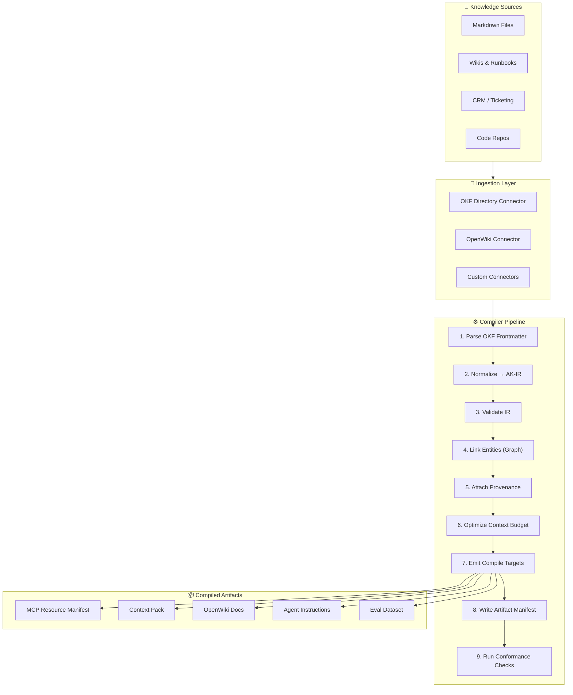
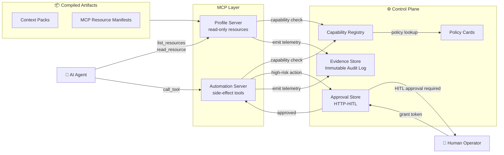
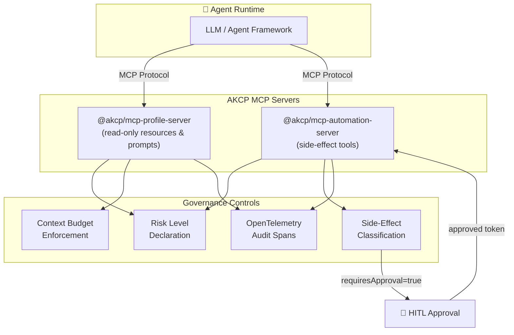
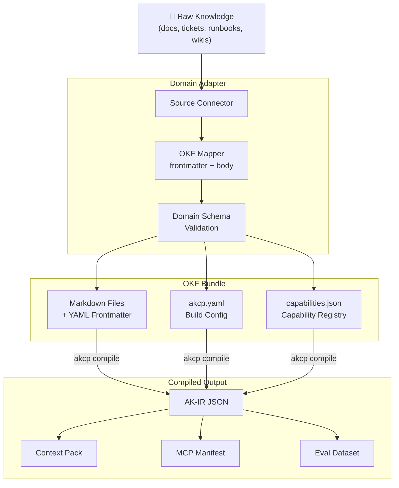
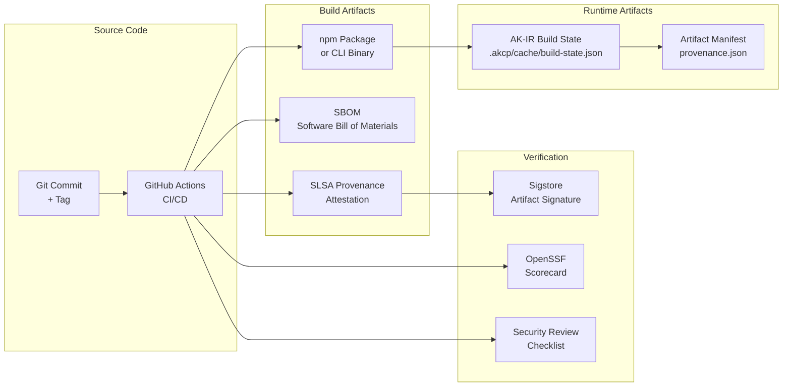

# Architecture Diagrams

This page collects the key architectural diagrams for the **Agent Knowledge Compiler and Control Plane (AKCP)**. Each diagram is maintained as Mermaid source and rendered natively on GitHub.

---

## 1. Compiler Pipeline

The AKCP compiler transforms raw, human-authored knowledge into deterministic, agent-consumable artifacts through a structured pipeline.

---

## 2. Control Plane Runtime

The Control Plane governs how agents interact with compiled artifacts at runtime.

---

## 3. MCP Integration

How AKCP wraps the Model Context Protocol with governance controls.

---

## 4. Domain Adapter Lifecycle

How organizational knowledge flows from raw source systems into compiled AKCP artifacts.

---

## 5. Supply Chain & Release Evidence

How AKCP ensures end-to-end artifact traceability and supply chain integrity.

---

## Related Docs

- [Compiler Pipeline Concepts](../concepts/compiler.md)
- [Control Plane Concepts](../concepts/control-plane.md)
- [MCP Security](../security/mcp-security.md)
- [Supply Chain Security](../security/supply-chain.md)
- [Domain Adapter Guide](../guides/create-domain-adapter.md)
