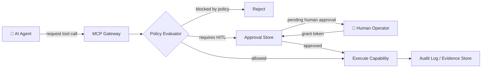

# The Control Plane

The **Control Plane** is the runtime governance layer of AKCP. It intercepts all agent actions before they reach underlying systems, enforcing policies, acquiring human approvals, and logging evidence. While the [Compiler Pipeline](compiler.md) is a build-time concern, the Control Plane is a runtime concern.

---

## Core Components

### 1. Capability Registry

The Capability Registry is the authoritative index of everything an agent is permitted to do within a domain. Each capability declares:

- A unique `capabilityId`
- A `riskLevel` (`low`, `medium`, `high`, `critical`)
- A `sideEffects` classification (`none`, `idempotent`, `destructive`)
- Whether it `requiresApproval`
- Its input/output schema (JSON Schema or Zod)

See [Capability Registry](../security/capability-registry.md) for the full schema.

### 2. Policy Cards

A Policy Card is a machine-readable governance document attached to a domain. It specifies:

- Which capabilities are available in this domain
- The minimum autonomy level required to invoke each capability
- Data handling rules (e.g., PII redaction, tenant isolation)
- Audit requirements (e.g., log all tool inputs)

See [Policy Cards Specification](../specs/policy-cards.md).

### 3. Approval Store (HITL)

The Approval Store provides Human-in-the-Loop (HITL) gating. When a capability is marked `requiresApproval: true`, the MCP automation server issues an approval request and pauses execution until a human operator grants a time-limited token.

- Approvals are stored in a SQLite-backed store (`better-sqlite3`)
- Tokens are time-limited (TTL) and single-use
- All approval events are recorded in the Evidence Store

See [HITL Documentation](../security/hitl.md).

### 4. Evidence Store (Audit Log)

The Evidence Store is an immutable, append-only audit log. Every MCP tool call, capability invocation, approval event, and policy decision is recorded. OpenTelemetry spans provide structured telemetry for observability.

---

## MCP Integration

AKCP wraps the [Model Context Protocol (MCP)](https://modelcontextprotocol.io) with the governance components above. Two server types are provided:

| Server | Package | Purpose |
|--------|---------|---------|
| **Profile Server** | `@akcp/mcp-profile-server` | Exposes read-only resources and prompts — compiled context packs, domain knowledge, agent instructions |
| **Automation Server** | `@akcp/mcp-automation-server` | Exposes side-effect tools (e.g., browser automation, API calls) with HITL and risk-level enforcement |

### Transport Topologies

1. **Local Transport (`stdio`)**: The MCP server is spawned as a child process, communicating via standard input/output. Recommended for local workflows requiring low latency and strong isolation.
2. **Remote Transport (`HTTP/SSE`)**: The server operates as an external network endpoint. Calls are sent via HTTP POST; server events are streamed via Server-Sent Events (SSE). Used for shared cloud deployments.

---

## MCP Primitive Types

A compliant MCP server exposes three categories of primitives:

| Primitive | Description | AKCP Usage |
|-----------|-------------|------------|
| **Resources** | Read-only data nodes exposed to the LLM | Compiled context packs, domain concepts, policy summaries |
| **Prompts** | Structured system-level templates | Agent instruction sets, task-specific context |
| **Tools** | Executable functions with side effects | Browser automation, API calls, approval workflows |

All tools must validate inputs against strict JSON schemas and return structured `ToolSuccess<T>` or `ToolFailure` responses. See [MCP Tool Contracts](../specs/mcp-tool-contracts.md).

---

## Spec-Driven Development

AKCP follows Spec-Driven Development (SDD). Specifications serve as the primary source of truth before any implementation begins:

1. **Specify**: Define functional scope via RFC or ADR.
2. **Plan**: Map requirements to concrete components.
3. **Implement**: Build against the spec with strict TypeScript validation.
4. **Validate**: Automated tests verify compiler safety and protocol rules.
5. **Conform**: Conformance rules check spec adherence at build time.

See [Spec Governance](../governance/spec-governance.md) and [Conformance Specification](../specs/conformance.md).

---

## Quality Assurance

| Layer | Approach |
|---|---|
| **Deterministic Validation** | Parsers check YAML syntax against schema boundaries; missing required fields cause fatal errors |
| **MCP Fault Injection** | Mock servers test retry behavior under rate limits and malformed payloads |
| **Contract Tests** | `ToolSuccess<T>` / `ToolFailure` response contracts are tested against every exposed tool |
| **Security Tests** | Prompt injection, path traversal, and output validation are tested in isolation |

See [Testing Guide](../guides/testing.md).

---

## Related Docs

- [Architecture Overview](../architecture/README.md)
- [MCP Security](../security/mcp-security.md)
- [Autonomy Levels](../governance/autonomy-levels.md)
- [HITL Documentation](../security/hitl.md)
- [Policy Cards](../specs/policy-cards.md)
