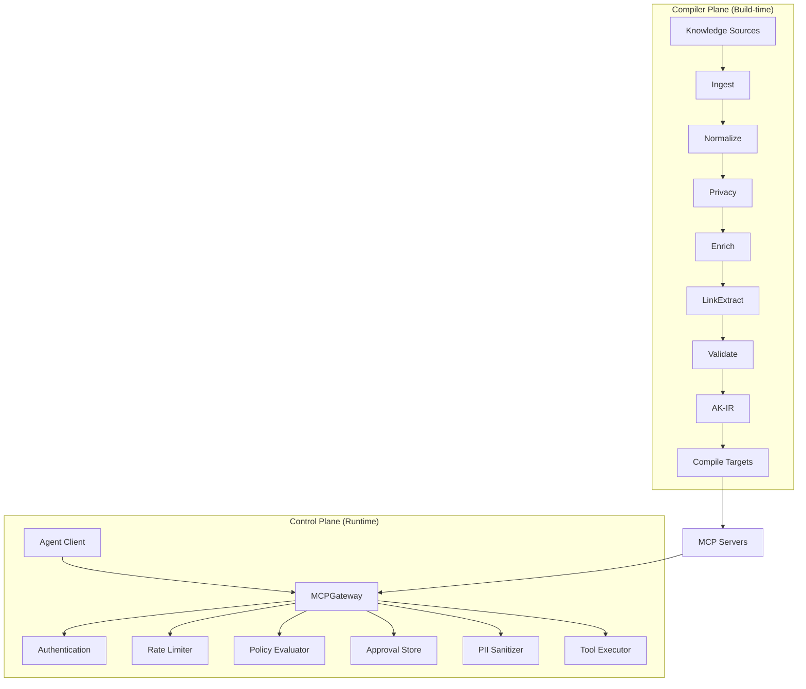

# AKCP Conceptual Overview

## The Problem

AI agents today lack deterministic grounding. They retrieve knowledge probabilistically (RAG), execute tools without governance (raw MCP), and operate without audit evidence. In regulated environments, this is unacceptable.

## The AKCP Solution

AKCP addresses this through two complementary planes:

### 1. Compiler Plane (Build-time)

Transforms organizational knowledge into governed, versioned, agent-consumable artifacts:

```
Raw Knowledge (OKF) → Compiler Pipeline → Agent Knowledge IR (AK-IR) → Compile Targets
```

The compiler pipeline runs 6 stages:

1. **Ingest** — Reads OKF documents from configured connectors
2. **Normalize** — Parses frontmatter, resolves types, validates structure
3. **Privacy** — Detects and redacts PII (CPF, SSN, emails, etc.)
4. **Enrich** — Adds metadata, timestamps, hashes
5. **Link Extract** — Builds the knowledge graph from cross-references
6. **Validate** — Runs lifecycle rules, capability validation, integrity checks

### 2. Control Plane (Runtime)

Governs how agents discover, retrieve, and act on compiled knowledge:

- **MCPGateway** — Central enforcement point for all agent capability requests
- **Policy Cards** — Declarative YAML constraints on autonomy, tools, and side-effects
- **Authentication** — API key auth with SHA-256 hashing, scopes, TTL, brute-force protection
- **Rate Limiting** — Token bucket per-agent rate control
- **HITL Approvals** — Cryptographic approval tokens bound to specific payloads
- **PII Sanitization** — Post-execution output redaction
- **WAF** — Prompt injection detection (Lakera API + regex fallback)
- **Audit Telemetry** — OpenTelemetry traces and metrics for every decision

## Key Concepts

| Concept            | Description                                                                        |
| ------------------ | ---------------------------------------------------------------------------------- |
| **OKF**            | Open Knowledge Format — portable markdown+frontmatter for organizational knowledge |
| **AK-IR**          | Agent Knowledge Intermediate Representation — the compiled AST output              |
| **Policy Card**    | YAML-defined governance constraints with NIST/OWASP mappings                       |
| **Compile Target** | Output format (MCP resources, context packs, OpenWiki, eval datasets, etc.)        |
| **Context Pack**   | Budget-optimized knowledge selection for agent consumption                         |
| **Domain Adapter** | Industry-specific configuration (IT Ops, Career, Customer Support)                 |

## Architecture at a Glance



## What AKCP is NOT

- **Not a vector database or RAG pipeline** — focuses on determinism, not probabilistic retrieval
- **Not an agent framework** — does not orchestrate agents (use LangGraph/AutoGen for that)
- **Not a replacement for MCP** — wraps MCP with governance, like a firewall wraps HTTP
- **Not OKF** — OKF is the input format; AKCP is the compiler and control plane around it

For detailed comparisons, see **[How AKCP Compares](comparison.md)**.

## Next Steps

- **[Quickstart](../getting-started/quickstart.md)** — Try AKCP in 5 minutes
- **[OKF Format](okf.md)** — Understand the input format
- **[Compiler](compiler.md)** — Deep dive into the compilation pipeline
- **[Control Plane](control-plane.md)** — Understand runtime governance
