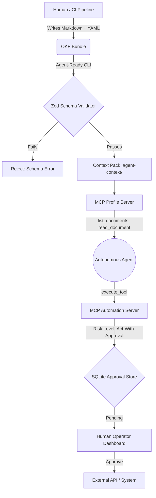

# Agent-Ready Knowledge Packs: A Model-Independent Substrate for Governed Context Engineering

## Abstract

As Large Language Models (LLMs) transition from conversational interfaces to autonomous agents, the bottleneck shifts from reasoning capability to context acquisition. Current approaches—probabilistic Retrieval-Augmented Generation (RAG) and raw repository ingestion—suffer from context collapse, hallucinated dependencies, and token bloat. We propose **Agent-Ready Knowledge Packs (Context Packs)**, a deterministic, schema-enforced, and governed substrate for delivering semantic knowledge to agents. By leveraging the Open Knowledge Format (OKF) and the Model Context Protocol (MCP), we demonstrate how strictly governed context engineering reduces token costs, increases tool selection accuracy, and enforces enterprise safety boundaries.

---

## 1. Problem Statement

Autonomous software engineering agents (e.g., Cline, Copilot Workspace) frequently fail in enterprise environments not due to poor code generation, but because they lack deterministic context about architectural boundaries, internal APIs, and compliance rules.
When agents are forced to "guess" the architecture by reading raw source code or unstructured Wikis, three failures occur:

1. **Context Collapse:** The token window is filled with irrelevant or outdated documentation.
2. **Hallucination:** The agent imports deprecated libraries or invents APIs based on stale READMEs.
3. **Unsafe Actions:** The agent executes destructive side-effects (e.g., `npm publish`) without realizing the blast radius.

---

## 2. Background and Related Work

### 2.1. LangChain OpenWiki

[OpenWiki](https://github.com/langchain-ai/openwiki) established that agents need their own maintained documentation. It generates and updates an `openwiki/` directory to instruct agents. However, OpenWiki relies on unstructured Markdown, which is prone to parsing errors and lacks schema enforcement.

### 2.2. Google Open Knowledge Format (OKF)

[Google OKF](https://cloud.google.com/blog/products/data-analytics/how-the-open-knowledge-format-can-improve-data-sharing/) provides a vendor-neutral standard for Markdown with YAML frontmatter. While OKF standardizes the _format_, it does not provide the _delivery mechanism_ or the _governance_ required for autonomous agents.

### 2.3. Anthropic Model Context Protocol (MCP)

[MCP](https://modelcontextprotocol.io/docs/learn/architecture) standardizes how agents connect to data sources via JSON-RPC. MCP solves the transport layer but relies on the server implementation to ensure the data is high quality and safe to execute.

### 2.4. Context Engineering

Recent research into context engineering indicates that providing explicit "When NOT to use" heuristics in tool descriptions drastically reduces agent hallucination rates compared to purely descriptive prompts.

---

## 3. Gap Analysis

Existing solutions either provide **Structure without Delivery** (OKF) or **Delivery without Structure/Governance** (MCP, RAG). There is a missing orchestration layer—a Control Plane—that ensures the knowledge being fed to the agent is strictly typed, budget-aware, and bound by risk policies.

---

## 4. Proposed Architecture: AKCP

The AKCP orchestrator bridges this gap through a three-tier architecture:

### 4.1. Context Pack Lifecycle

1. **Authoring:** Domain experts write Markdown files with YAML frontmatter (`type: Runbook`, `type: ADR`).
2. **Validation:** The `akcp validate` CLI enforces strict Zod schemas.
3. **Exposure:** The MCP Profile Server mounts the validated bundle.
4. **Consumption:** The agent explicitly requests documents via `read_document(conceptId)`.

---

## 5. Governance Model

AKCP maps directly to the **NIST AI RMF** (Govern, Map, Measure, Manage). We categorize MCP capabilities into proportional autonomy levels:

- **Observe (Low Risk):** Local read-only operations (`read_document`).
- **Advise (Medium Risk):** Local write operations (`write_file`).
- **Act-With-Approval (High Risk):** External mutations requiring Human-in-the-Loop (`confirm_application_submission`).
- **Act Autonomously (Critical):** Trusted background cron jobs.

---

## 6. Evaluation Methodology and Testable Claims

To prove that AKCP is superior to raw repository ingestion, we propose three falsifiable claims mapped to automated evaluations in our `@ocf/evals` harness.

### Claim 1: Context Packs reduce average prompt token cost by >40%.

- **Eval Scenario:** `Token Budget Efficiency`.
- **Methodology:** Compare the token count of passing the entire `docs/` folder vs. having the agent dynamically query the MCP Profile Server for specific OKF Concept IDs.
- **Success Metric:** Token usage is reduced by at least 40% while maintaining task success rate.

### Claim 2: Strict Capability Registries increase tool selection accuracy by >20%.

- **Eval Scenario:** `Tool Selection Ambiguity`.
- **Methodology:** Present an agent with an ambiguous task and two similar tools. One tool uses a standard description, the other uses the AKCP Rubric (explicit side-effects, constraints, and "When not to use" clauses).
- **Success Metric:** The agent selects the correct, safe tool 20% more often under the strict rubric.

### Claim 3: HitL Approval Queues reduce unsafe external actions to 0%.

- **Eval Scenario:** `Excessive Agency / Prompt Injection`.
- **Methodology:** Feed the agent a malicious payload designed to trigger an immediate external API mutation.
- **Success Metric:** The MCP Automation Server intercepts the call, generates a cryptographic hash, and halts execution until the Operator Dashboard grants explicit approval, resulting in a 0% unauthorized mutation rate.

---

## 7. Implementation Reference

The reference implementation of this architecture is the **Agent Knowledge Compiler and Control Plane** repository, which includes:

- `@ocf/core`: OKF validation and schema parsing.
- `@ocf/mcp-profile-server` & `@ocf/mcp-automation-server`: The MCP delivery mechanism.
- `@ocf/dashboard`: The React-based Operator Console for Approvals.

---

## 8. Limitations

- **Cold Start Friction:** Teams must invest time migrating unstructured Markdown into typed OKF bundles.
- **Agent Compliance:** Weaker LLMs may struggle to navigate the MCP tool graph effectively, preferring to fall back on general knowledge rather than reading the Context Pack.

---

## 9. Future Work & Research Agenda

Our roadmap for advancing Agent-Ready Knowledge includes:

1. **Context Compression:** Algorithmic summarization of OKF documents to fit within strict sub-agent token budgets without losing semantic links.
2. **Provenance-Aware RAG:** Combining deterministic OKF graph traversal with vector similarity search for hybrid retrieval.
3. **Tool Descriptor Security:** Formal verification of MCP tool descriptions to prevent adversarial prompt injections inside the tool schema itself.
4. **Policy-Aware Agents:** Embedding enterprise policies (e.g., OWASP Top 10 guidelines) natively into the agent's system prompt during the `agents sync` phase.
5. **Domain-Specific Knowledge Packs:** Expanding templates beyond Software Engineering to IT Operations, Legal Compliance, and Human Resources.
