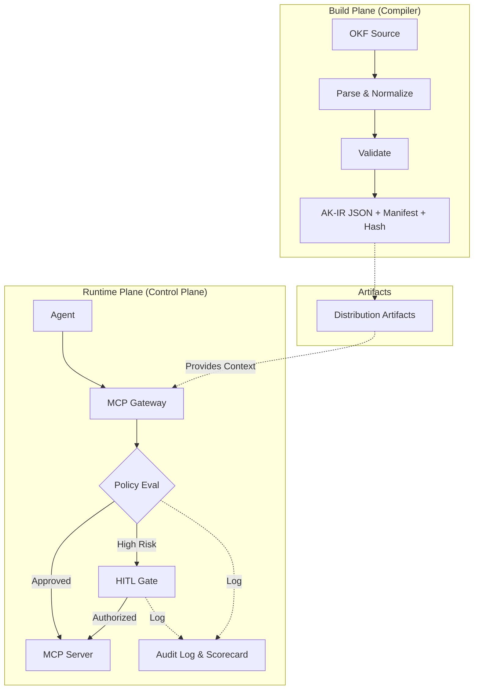

# Whitepaper: Agent Knowledge Compiler and Control Plane

> **Status:** DRAFT — v0.1.0-draft  
> **Category:** Research & Thesis

---

## Abstract

Modern AI agents suffer from a fundamental structural problem: they operate on probabilistic associations rather than deterministic, governed knowledge. This paper introduces the **Agent Knowledge Compiler and Control Plane (AKCP)** as a new product category that separates the _compilation_ of organizational knowledge from its _runtime governance_. AKCP transforms unstructured documentation into type-safe, versioned, cryptographically-verified context artifacts, and then governs how agents discover and act upon them via machine-readable Policy Cards and a Zero-Trust Gateway.

---

## 1. The Problem

### 1.1 Structural Hallucination

Large Language Models (LLMs) produce outputs based on the statistical distribution of their training data. When operating as agents within an enterprise, this statistical nature collides with organizational requirements for precision, verifiability, and accountability.

We term this **Structural Hallucination**: the agent's inability to ground its responses in specific, verified, and up-to-date organizational facts—not because the model is fundamentally broken, but because the _knowledge infrastructure_ is absent. The agent has no deterministic source of truth to anchor against.

### 1.2 The Knowledge Supply Chain Gap

The contemporary AI tool landscape addresses parts of this problem:

- **Vector databases** provide fuzzy semantic retrieval, but offer no provenance, versioning, or governance.
- **RAG pipelines** are probabilistic and difficult to audit.
- **API integrations** expose live systems, but carry inherent side-effect risk without guardrails.

No tool provides a complete **knowledge supply chain**: a pipeline from raw organizational documentation to verified, governed, agent-consumable artifacts.

---

## 2. Prior Art

| Technology                       | Contribution                                                                                     | Limitation                                                                                            |
| -------------------------------- | ------------------------------------------------------------------------------------------------ | ----------------------------------------------------------------------------------------------------- |
| **OKF (Open Knowledge Format)**  | Provides portable Markdown + YAML frontmatter primitives for human and agent-friendly knowledge. | Describes the source format; does not define compilation, governance, or runtime behavior.            |
| **MCP (Model Context Protocol)** | Provides a standardized RPC protocol for agent-tool interaction.                                 | Introduces a significant attack surface without built-in semantic structure or access control.        |
| **OpenWiki (LangChain)**         | CI-driven documentation freshness for agent consumption.                                         | Authors documentation; does not compile, govern, or control access to it.                             |
| **REGAL**                        | Registry-driven grounding architecture for deterministic enterprise telemetry.                   | Focuses on structured data; does not address unstructured document compilation or policy enforcement. |

AKCP synthesizes and extends these prior works, filling the gap between documentation authoring and governed runtime execution.

---

## 3. Architecture

AKCP introduces two operational planes:

### 3.1 Build Plane

The compiler is a deterministic, multi-stage pipeline. Its output is a verifiable, byte-reproducible AK-IR artifact.

### 3.2 Runtime Plane

The control plane intercepts all agent interactions at the MCP Gateway, evaluates the active Policy Card, solicits Human-in-the-Loop approvals for high-risk actions, and maintains an immutable audit log.

---

## 4. The Compiler Model

Inspired by traditional software compilers, AKCP treats knowledge transformation as a strictly defined compilation process:

- **Lexing/Parsing:** OKF frontmatter + Markdown body parsing.
- **Semantic Analysis:** Schema validation, relationship resolution, cross-document linking.
- **Optimization:** Token estimation, deduplication, freshness filtering.
- **Code Generation (Emission):** Target-specific artifact production (OpenWiki, eval datasets, MCP resource manifests).

This allows knowledge compilation to be integrated into CI/CD pipelines, tested, diffed, and audited like source code.

---

## 5. The Control Plane Model

The control plane is modeled after principles from NIST AI RMF (Govern, Map, Measure, Manage) and the OWASP Top 10 for LLMs. Its primary components are:

1. **Zero-Trust Gateway:** All agent tool calls are intercepted and evaluated before execution. Default deny.
2. **Policy Cards (Machine-Readable):** YAML-based, version-controlled governance rules co-located with the knowledge bundle. Informed by the Policy Cards academic research (arXiv:2510.24383).
3. **HITL Approval Gates:** Configurable approval requirements for destructive or high-risk tool invocations.
4. **Immutable Audit Log:** All access decisions are cryptographically recorded.

---

## 6. Security

AKCP's security model is designed to defend against the primary LLM/agentic attack vectors identified by OWASP and academic research:

| Threat                                    | AKCP Mitigation                                                                               |
| ----------------------------------------- | --------------------------------------------------------------------------------------------- |
| **Prompt Injection (OWASP LLM01)**        | MCP Gateway rejects tool calls that violate policy, regardless of prompt content.             |
| **Insecure Tool Plugins (OWASP LLM07)**   | Plugin architecture requires explicit permission declarations in `akcp-plugin.json`.          |
| **MCP Tool Poisoning (arXiv:2512.06556)** | Compiled AK-IR provides a verified, canonical set of tool definitions.                        |
| **Supply Chain Risk**                     | `sourceHash` and artifact-level hashes in `akcp-manifest.json` enable integrity verification. |

---

## 7. Evaluation

AKCP includes a built-in evaluation framework via the `eval-dataset` compilation target. This allows organizations to:

1. Generate ground-truth Q&A pairs from their knowledge base.
2. Continuously benchmark agent grounding accuracy against verified OKF content.
3. Detect knowledge drift over time.

---

## 8. Adoption Path

Organizations can adopt AKCP incrementally, following the maturity model:

1. **Level 1 (Ad-hoc):** Existing docs. No compilation.
2. **Level 2 (Compiled):** Docs compiled into OKF + AK-IR. Agents load deterministically.
3. **Level 3 (Governed):** Policy Cards and HITL gates active.
4. **Level 4 (Enterprise):** Centralized governance, provenance tracking, scorecard monitoring.

For deployment playbooks across domains (like HR onboarding or support tier-1 macros), refer to the [Enterprise Domain Adapters](../enterprise/domain-adapter-guide.md).

---

## 9. Conclusion

AKCP defines a new product category at the intersection of knowledge management, AI safety, and developer tooling. By separating compilation from governance, it brings the same rigor applied to software source code to the management of organizational knowledge for AI agents. This is not a vendor lock-in play; it is a specification designed to become an interoperable open standard, building on OKF and MCP rather than replacing them.
