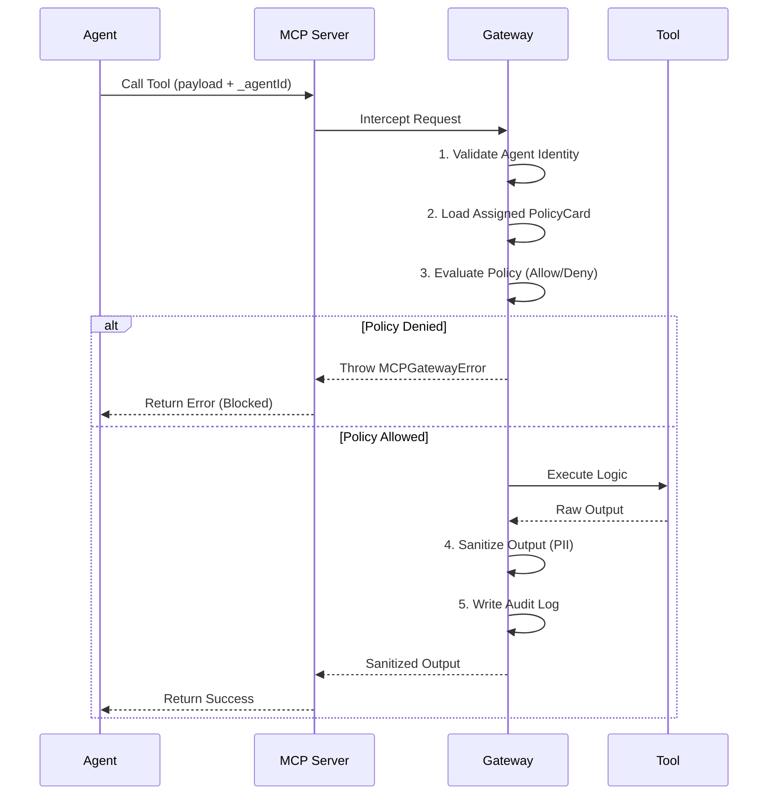

# MCP Zero-Trust Gateway

## Overview

The **MCP Zero-Trust Gateway** is a core security component in the Agent Knowledge Compiler and Control Plane (AKCP). It acts as an interceptor between raw Model Context Protocol (MCP) clients and the underlying tools, resources, and prompts exposed by the server.

Standard MCP implicitly trusts the client to execute any tool it has discovered. The Zero-Trust Gateway introduces a hard boundary, ensuring that every tool execution is explicitly validated against the agent's identity and its associated Policy Card.

## Threat Model & Mitigations

| Threat                | Description                                                                 | Gateway Mitigation                                                                                                                                                        |
| --------------------- | --------------------------------------------------------------------------- | ------------------------------------------------------------------------------------------------------------------------------------------------------------------------- |
| **Confused Deputy**   | An agent is tricked into calling a high-risk tool on behalf of an attacker. | The Gateway enforces explicit **Agent Identities**. High-risk tools are tied to strict PolicyCards that require out-of-band human approval (`approvalRequirements`).      |
| **Token Passthrough** | An attacker forwards a valid approval token to a different tool.            | The Gateway cryptographically binds approval tokens to the specific `toolName` and `payloadHash`.                                                                         |
| **Lateral Movement**  | A compromised low-privilege agent attempts to access restricted resources.  | The Gateway maps each `agentId` to a specific `PolicyCard` (e.g., `sandbox-only`), dropping out-of-bounds requests immediately.                                           |
| **Data Exfiltration** | An agent reads sensitive PII and attempts to leak it via external tools.    | The Gateway supports strict `piiHandling` (`redact` or `deny`), stripping sensitive information like SSNs or emails from tool outputs before returning them to the agent. |

## Architecture

## Local-First Considerations

Currently, standard MCP over standard input/output (STDIO) does not support out-of-band metadata headers. To enforce Zero-Trust locally, all tools in AKCP have been augmented with an `_agentId` parameter in their JSON schema. The Gateway extracts this parameter from the payload to determine the client's identity.

In future iterations (e.g., Remote MCP over SSE/HTTP), the `_agentId` will be extracted from cryptographic tokens (like JWTs) passed via standard authorization headers, completely removing it from the payload schema.
